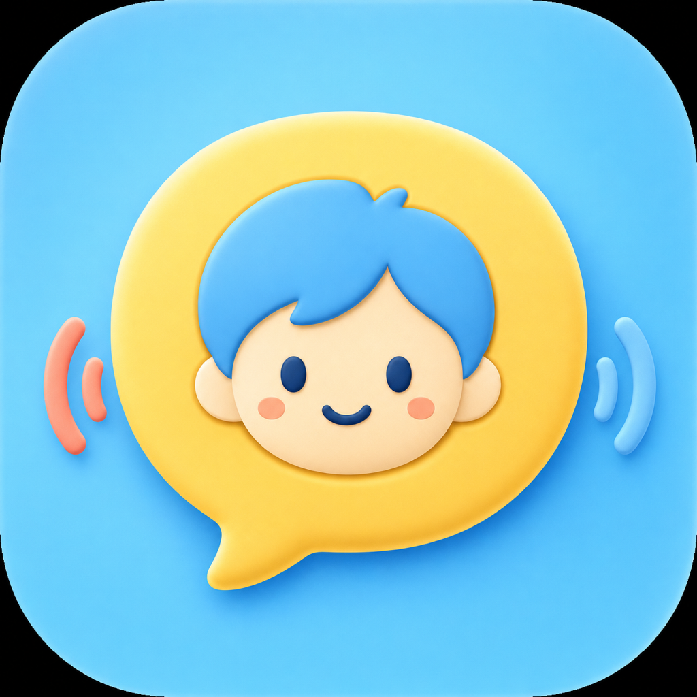

# Click2Chat

Click2Chat은 Bluetooth 버튼 한 번으로 아이가 ChatGPT 프로젝트의 새 음성 대화를 시작하거나 종료할 수 있게 해 주는 macOS 메뉴바 앱입니다. 전용 Google Chrome 프로필을 열고, 지정한 프로젝트로 이동한 뒤 Voice Mode를 실행합니다.



## 요구사항

- macOS 14 Sonoma 이상
- Google Chrome
- Node.js 18 이상 (`node` 명령을 실행할 수 있어야 함)
- ChatGPT Voice를 사용할 수 있는 계정과 ChatGPT 프로젝트 URL
- macOS에서 인식되는 마이크, 스피커, Bluetooth/HID 버튼

## GitHub Release로 설치

1. 저장소의 **Releases**에서 최신 `Click2Chat-vX.Y.Z.zip`을 내려받아 압축을 풉니다.
2. `Click2Chat.app`을 `/Applications`로 옮깁니다.
3. 앱을 실행하고 메뉴바의 **Settings…**에서 프로젝트와 장치를 설정합니다.

```bash
open /Applications/Click2Chat.app
```

첫 Release는 ad-hoc 서명되어 Apple 공증을 받지 않습니다. macOS가 실행을 막으면 Finder에서 앱을 Control-클릭해 **열기**를 선택하거나, **시스템 설정 → 개인정보 보호 및 보안 → 확인 없이 열기**를 사용하십시오. 출처를 확인하지 않은 바이너리에는 이 절차를 사용하지 마십시오.

자동 실행은 **시스템 설정 → 일반 → 로그인 항목**에서 `/Applications/Click2Chat.app`을 추가합니다.

## 소스에서 설치

```bash
git clone https://github.com/DongyoungKim2/Click2Chat.git
cd Click2Chat
chmod +x scripts/install.sh scripts/uninstall.sh
scripts/install.sh
```

설치 스크립트는 release 빌드를 만들고 `/Applications/Click2Chat.app`과 로그인 LaunchAgent를 설치합니다. 기존 사용자 설정은 덮어쓰지 않습니다.

직접 빌드와 진단은 다음 명령을 사용합니다.

```bash
swift build
swift run Click2Chat --diagnose
```

## 설정 메뉴

메뉴바의 Click2Chat 아이콘을 누르고 **Settings…**를 선택합니다.

필수 설정:

- **ChatGPT 프로젝트 URL**: 사용할 프로젝트의 전체 `https://chatgpt.com/...` 주소
- **마이크 / 스피커**: 현재 macOS가 인식한 장치 목록에서 선택하거나 정확한 이름 입력
- **버튼 이름**: Bluetooth/HID 제품명에 포함되는 문자열. 여러 값은 쉼표로 구분

선택 설정:

- **첫 인사**: Voice 시작 후 ChatGPT에 한 번 전송할 문장. 비우면 자동 인사를 보내지 않음
- Chrome 경로와 전용 프로필 경로
- 디버깅 포트, 입력 간격, 상태 확인과 웹 로딩 시간

저장한 값은 다음 경로의 사용자별 설정 파일에 기록되며 앱을 다시 시작하면 적용됩니다.

```text
~/Library/Application Support/Click2Chat/config.json
```

이전 버전의 `.env`만 있고 `config.json`이 없다면 최초 실행 시 값을 한 번 가져옵니다. 이후 설정은 Settings 메뉴에서 관리합니다.

## 처음 설정하기

1. Click2Chat을 실행하고 **Settings…**에서 프로젝트 URL과 장치를 저장한 뒤 앱을 다시 시작합니다.
2. 메뉴바 Click2Chat 메뉴에서 **Open Project**를 선택합니다.
3. 열린 전용 Chrome 창에서 ChatGPT에 로그인합니다.
4. 프로젝트 URL을 변경해야 한다면 주소창의 전체 URL을 Settings에 입력합니다.
5. Chrome에서 해당 사이트의 마이크 사용을 허용하고 Voice 버튼이 보이는지 확인합니다.
6. 앱을 다시 시작하고 메뉴의 **Run Diagnostics**로 장치 이름과 연결 상태를 확인합니다.

마이크와 스피커 이름은 **시스템 설정 → 사운드**에서 확인할 수 있습니다. 버튼 제품명은 `swift run Click2Chat --diagnose` 결과의 `HID products`에서 확인합니다.

## macOS 권한

- **손쉬운 사용**: ChatGPT Voice UI를 안정적으로 제어하는 데 사용
- **입력 모니터링**: macOS 버전과 버튼 종류에 따라 HID 입력 감지에 필요
- **자동화**: Click2Chat이 Google Chrome을 제어할 때 필요
- **마이크**: `chatgpt.com`을 사용하는 Google Chrome에 허용

권한 요청을 다시 유도하려면 다음을 실행할 수 있습니다.

```bash
/Applications/Click2Chat.app/Contents/MacOS/Click2Chat --request-permissions
```

## 사용과 업데이트

- 버튼을 누르면 새 Voice 대화를 시작하고, 대화 중 다시 누르면 종료합니다.
- 메뉴의 **Start New Voice Chat**은 기존 대화를 끝내고 새 대화를 시작합니다.
- Settings에서 저장한 뒤에는 Click2Chat을 종료하고 다시 실행해야 합니다.
- Release 설치는 새 앱으로 `/Applications/Click2Chat.app`을 교체합니다. 설정과 전용 Chrome 프로필은 유지됩니다.
- 소스 설치는 저장소에서 `git pull` 후 `scripts/install.sh`을 다시 실행합니다.

제거:

```bash
scripts/uninstall.sh
```

Release 앱만 설치했다면 `/Applications/Click2Chat.app`과 로그인 항목을 직접 제거하십시오. 사용자 설정과 Chrome 로그인 정보를 완전히 지우려면 다음 폴더도 삭제해야 합니다.

```text
~/Library/Application Support/Click2Chat
```

## 문제 해결

- **프로젝트를 열지 못함**: Settings의 프로젝트 URL이 전체 주소인지, 전용 Chrome 프로필에 로그인되어 있는지 확인합니다.
- **Voice 버튼을 찾지 못함**: ChatGPT UI에서 Voice 사용 가능 여부와 Chrome 마이크 권한을 확인합니다.
- **장치를 찾지 못함**: 진단 결과의 이름을 Settings에 공백과 대소문자를 포함해 정확히 입력합니다.
- **Chrome 연결 실패**: 지정한 debugging port를 다른 Chrome 프로세스가 사용 중인지 확인하고 앱을 재시작합니다.
- **Node.js 오류**: `node --version`으로 Node.js 18 이상이 PATH에 있는지 확인합니다.

로그 위치:

```text
~/Library/Logs/Click2Chat.log
~/Library/Logs/Click2Chat.launchd.out.log
~/Library/Logs/Click2Chat.launchd.err.log
```

## 개인정보와 보안

ChatGPT 로그인 정보는 Click2Chat 전용 Chrome 프로필에 저장됩니다. 사용자 설정과 전용 Chrome 프로필은 앱 제거 시 자동 삭제되지 않습니다.
